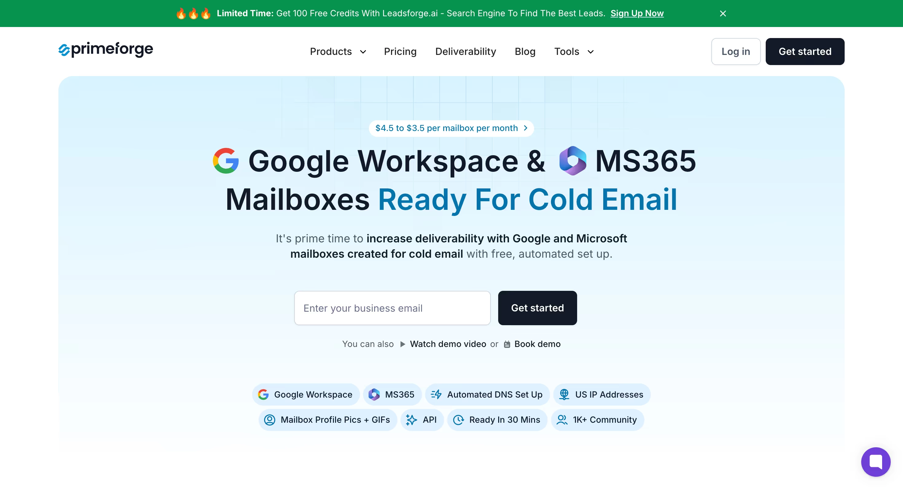
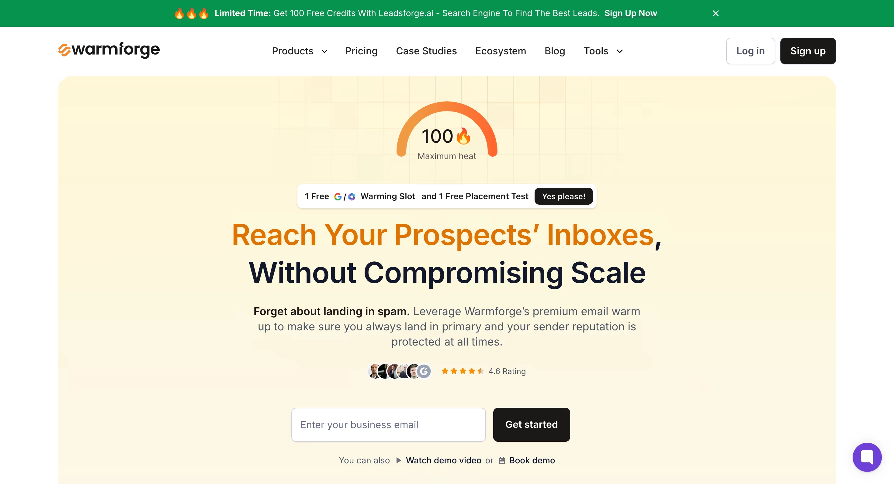

# 冷邮件完全指南:2025年从零到精通的实战手册

---

你可能听过这样的说法:冷邮件已死。

没人会读陌生人发来的邮件。现在都是TikTok、LinkedIn私信和各种新平台的天下。

纯属胡扯。

当所有人都在追逐新平台时,聪明的销售人员仍在用冷邮件悄悄赚钱。20%的回复率、每投入1美元回报36美元、真正有效的潜在客户开发、比任何其他渠道都快的成交速度。

冷邮件依然是成交的最佳方式之一。

**但问题来了**(也是大多数人失败的原因):2025年的冷邮件玩法彻底变了。

现在有效的方法,和"大师们"多年来教的完全相反。

不是发更多邮件,而是更少。不是广撒网,而是精准打击。不是通用模板,而是超个性化定制。

这篇文章会告诉你具体怎么做、如何产生效果,以及你能用上的经过验证的冷邮件最佳实践。

---

## 什么是冷邮件?

冷邮件是发给特定潜在客户的高度针对性、个性化消息——这些人符合你的理想客户画像,但从未与你的业务有过任何接触。

与发给订阅者或温暖联系人的营销邮件不同,冷邮件是为那些从未与你互动过的新联系人设计的。

**注意这里的关键词**:针对性和个性化。

最好的冷邮件感觉像是一场自然商业对话的开始。它们直接称呼收件人,提到关于潜在客户公司的具体细节(比如公司名称),承认他们可能面临的挑战(潜在客户的痛点),并提供适合他们情况的解决方案。

以下是冷邮件与其他推广方式的区别:

- 与电话销售不同,你的潜在客户可以在自己方便的时候阅读和回复
- 与社交媒体推广不同,你不用和猫咪视频、度假照片争夺注意力
- 与付费广告不同,你在进行直接的一对一对话
- 冷邮件是一种直接推广形式,让你能高效地接触潜在客户

比如,你可以用冷邮件询问尚未公开发布的职位空缺,主动联系组织中的关键人物。

**但关键在于**:冷邮件不是销售推销。

一旦你把重点放在自己和产品上,你就输了。最有效的冷邮件完全聚焦于潜在客户。它们提问、激发好奇心、邀请对话——通常会在个性化冷邮件中提到收件人的职位、公司名称或特定的痛点。

做得对的话,冷邮件一点都不"冷"。它们感觉温暖、相关、受欢迎。

## 发送冷邮件合法吗?

简短回答:是的,冷邮件100%合法。

自2003年CAN-SPAM法案建立以来,冷邮件在美国就是合法的。在欧洲,只要你有联系某人的"合法商业利益",根据GDPR规定也是合法的。

但合法的冷邮件和垃圾邮件之间有巨大差异。

垃圾邮件是你买了10万个随机邮箱地址,然后群发通用广告。

冷邮件是你研究特定潜在客户,个性化你的推广,并提供真正的价值。

要保持合法:

- 每封邮件必须包含清晰的退订链接
- 需要包含你的实际营业地址
- 不使用误导性主题
- 立即执行退订请求
- 通过验证收件人的邮箱确保他们能实际接收邮件,这有助于确保合规并提高送达率

如果你遵守这些基本的冷邮件规则,你可以每天发送冷邮件而不会有任何法律问题。

## 为什么冷邮件仍然主导B2B销售?

冷邮件推广仍然位列最佳B2B销售渠道榜首有几个原因。

首先,[43%的销售人员](https://saleslion.io/sales-statistics/43-of-sales-professionals-say-email-is-the-most-effective-channel-for-selling/)认为邮件是他们最有效的销售渠道。这意味着近一半的顶尖销售人员,包括销售代表,都把赌注压在邮件推广的效率和结果上。不是社交媒体。

不是付费广告。不是大家都在谈论的最新增长黑客。是邮件。

**最令人惊讶的是?**

[61%的决策者](https://www.salesforge.ai/blog/the-state-of-cold-email-2025-insights-strategies-and-best-practices)更喜欢接收冷邮件而不是其他推广方式。

这彻底粉碎了"没人想收到冷邮件了"的神话。

事实是,你试图接触的人——CEO、副总裁、总监和其他决策者——实际上更喜欢邮件,而不是电话、LinkedIn消息或任何其他形式的推广。

为什么?因为邮件给了他们控制权。他们可以在方便的时候阅读你的消息,如果需要可以转发给团队,并能深思熟虑地回复,而不是在突如其来的电话中措手不及。

此外,冷邮件之所以高效,是因为它允许你跟踪关键指标,如回复率,这有助于改进你的推广策略并提高活动成功率。

许多公司已经使用冷邮件促成销售,为社交媒体营销服务生成潜在客户,甚至通过联系网站所有者合作来进行链接建设。

冷邮件已经帮助各行各业的公司取得了可衡量的结果,使其成为B2B销售的验证工具。

## 2025年冷邮件的变化

如果你还在用2020年的方式发冷邮件,那你就做错了。

游戏规则彻底变了,大多数人还没收到消息。

旧方法全是关于数量。更多邮件意味着更多回复,对吧?错。

那种策略不仅已死——它有毒。它会比你说"退订"还快地毁掉你的发件人声誉。Gmail和Outlook等邮件提供商在检测群发邮件方面变得异常聪明,它们会直接把你的消息送进垃圾邮件文件夹。

新方法实际上比旧方法更好。

现在,向50-100个潜在客户发送的超精准活动,与大规模活动相比,能获得更高的回复率。

原因很简单。

当你只有50个潜在客户要发邮件时,你可以真正研究每一个人,收集关键细节,如他们的姓名、邮箱地址和职位。

你可以个性化你的消息。

你可以提到关于他们公司、行业或挑战的具体内容。

你可以让你的邮件感觉像是专门为他们写的——因为确实如此。否则,被冷邮件可能会感觉不个人化和通用。

记住,大多数冷邮件失败是因为缺乏个性化并错过这些关键细节,使它们看起来可疑或像垃圾邮件。

另外,请记住你的潜在客户阅读邮件的时间有限,所以你的消息需要简洁直接,才能在他们继续之前抓住他们的注意力。

所以现在,问题不是你是否应该适应这种新方法。

问题是你能多快做出转变。

## 如何撰写2025年能产生效果的冷邮件

现在你理解了为什么冷邮件有效以及有什么变化,让我们进入核心部分。

*你究竟如何构建一个能产生持续结果的冷邮件系统?*

简化推广的最有效方法之一是使用邮件模板。这些帮助你在扩展工作时保持一致性并节省时间。

大多数人直接跳到写邮件。这是个错误。在你写下一个字之前,你需要建立基础,确保你的邮件实际上能到达潜在客户的收件箱。

如果最终进入垃圾邮件箱,世界上写得最好的邮件也毫无价值。当你开始写作时,专注于制作有效的邮件正文——使其清晰、简洁和个性化,以提高参与度。

这就是为什么2025年成功的冷邮件遵循特定流程。在每个阶段使用经过验证的冷邮件模板可以进一步改善你的结果。

跳过任何一步,你就是在为失败做准备。

遵循所有五个步骤,你就会有一个持续产生20%+回复率的系统。

### 步骤1 - 定义你的目标

每个成功的冷邮件活动都始于一个清晰、具体的目标。

你是想生成潜在客户、预订更多会议,还是完成更多销售?

也许你想介绍新服务或为网络研讨会带来流量。无论是什么,提前定义目标能让你的信息保持专注,让你的结果可衡量。

明确定义的目标帮助你微调主题行、邮件内容和后续邮件以获得最大影响。

例如,如果你的目标是生成潜在客户,你需要跟踪每个活动获得了多少回复和转化。如果你的目标是安排更多会议,衡量收到冷邮件后实际预订电话的潜在客户有多少。

通过设定清晰的目标,你可以调整冷邮件活动的每个部分——从开场白到行动号召——以推动那个结果。

此外,你将能够跟踪进度,发现什么有效,并做出数据驱动的调整以随时间改善结果。

记住,成功的冷邮件活动总是围绕单一、专注的目标构建的。

### 步骤2 - 确定你的目标受众

在你考虑撰写冷邮件之前,你需要确切知道你要联系谁。

确定你的目标受众是任何成功冷邮件活动的基础。

这不仅仅是挑选一个随机的公司或职位列表——而是深入了解你的潜在客户是谁、他们关心什么、以及是什么驱动他们。

从研究理想客户画像的人口统计、需求和痛点开始。

**看看你现有的客户**:他们在什么行业?他们担任什么职位?你的服务为他们解决了什么问题?

使用这些数据创建目标受众的清晰画像。

利用LinkedIn Sales Navigator、BuiltWith或UpLead等工具深入挖掘。这些平台让你根据公司规模、行业、技术栈等筛选潜在客户——所以你不仅仅是冷邮件任何人,而是最有可能从你的解决方案中受益的正确的人。

你越具体,你的冷邮件工作就越有效。

当你深入了解你的受众时,你可以制作直接针对他们需求的个性化冷邮件,大大增加生成合格潜在客户和开始真正销售对话的机会。

### 步骤3 - 了解痛点

如果你想让你的冷邮件被注意到——并得到回复——你需要表明你理解潜在客户的痛点。

痛点是你的潜在客户每天面临的现实世界的挑战、挫折或障碍。在冷邮件活动中直接解决这些问题,正是将通用消息与实际获得回复的消息区分开来的关键。

那么,你如何发现这些痛点?

从研究你的目标受众开始。阅读行业报告,仔细查看在线评论,并关注人们在社交媒体上说什么。对当前客户进行调查或访谈,亲耳听到他们试图解决的问题。你甚至可以分析反馈和推荐来发现反复出现的主题。

一旦你确定了最紧迫的痛点,将它们编织到你的冷邮件中。向你的潜在客户表明你理解他们正在挣扎的事情——以及你的服务旨在帮助。

当你的冷邮件活动直接针对潜在客户的痛点时,你立即变得更相关和值得信赖,使他们更有可能回复并想了解更多。

### 步骤4 - 构建防弹邮件基础设施

你的邮件基础设施是决定你精心制作的邮件是进入收件箱还是消失在垃圾邮件文件夹的基础。

这不仅仅是拥有一个邮件账户——而是创建一个Gmail和Outlook等邮件提供商信任的技术设置。

邮件基础设施包括几个关键组件:域名设置、DNS记录(SPF、DKIM、DMARC)、IP声誉、邮件认证和发送模式。每个部分共同作用,建立你作为合法发件人的可信度。

挑战在于,传统上设置适当的邮件基础设施需要技术专长和数小时的手动配置。

你需要了解DNS管理,在不同提供商之间配置多个记录,并不断监控送达率指标。

对大多数企业来说,这要么不可能,要么成本过高。

这就是专业邮件基础设施工具的用武之地。

无需花费数周学习DNS管理并冒犯关键错误的风险,你可以在几分钟内运行企业级邮件基础设施。

以下是你可以依赖的三大邮件基础设施工具:

#### Mailforge

例如,[Mailforge.ai](https://app.mailforge.ai/signup)专为需要可靠邮件基础设施而无需复杂性的企业设计。

它是一个共享IP基础设施解决方案,类似于Gmail或Outlook,但专门为冷邮件推广优化。它自动处理所有技术繁重工作。

当你向Mailforge添加域名时,平台会根据行业最佳实践自动配置DMARC、SPF、DKIM和自定义域名跟踪。这个通常需要数小时的过程在几分钟内完成。

该平台使用分布式基础设施模型,将你的邮箱账户分散到与数百万其他企业共享的IP池中。这种方法提供出色的送达率,因为你的邮件受益于整个网络的集体声誉。

#### Infraforge

虽然Mailforge使用共享基础设施,但Infraforge为需要最大控制和定制的企业提供专用的私有邮件基础设施。

[Infraforge](https://app.infraforge.ai/signup)为你的活动提供专用服务器和IP。这意味着你的发件人声誉完全在你的控制之下。没有人的糟糕发送实践会影响你的送达率,你可以根据自己的表现扩展发送量。

该平台包括多IP配置、SSL证书、域名掩码代理和API访问等高级功能。

Infraforge非常适合大型销售团队、代理机构或发送大量邮件的企业。专用IP方法意味着你可以在保持高送达率的同时每个域名发送更多邮件。

#### Primeforge

[Primeforge](https://app.primeforge.ai/signup)对邮件基础设施采取了不同的方法,提供专门为冷推广优化的Google Workspace和Microsoft 365邮箱。

这特别强大,因为ESP(邮件服务提供商)匹配——当你从潜在客户使用的同一提供商发送邮件时,送达率会显著提高。

大多数B2B专业人士使用Google Workspace或Microsoft 365作为他们的商务邮件。通过从这些相同平台发送,你更有可能进入他们的主收件箱,因为邮件提供商将通信识别为合法的商业往来。

Primeforge邮箱配备美国IP地址,并经过冷推广的实战测试。与消费者Gmail或Outlook账户不同,这些是专业级商务账户,即使在冷邮件活动中也能保持高发件人声誉。

该平台提供与Mailforge和Infraforge相同的自动DNS设置和管理功能,但具有主流提供商可信度的附加好处。你还可以大规模为每个邮箱设置个人资料图片甚至GIF,根据内部测试,这可以将回复率提高3-15%。

**价值主张很明确**:你获得主流提供商的送达率优势,而没有通常使用这些平台进行冷推广的限制。

### 步骤5 - 预热邮件账户

构建出色的邮件基础设施只是成功的一半。

另一半是预热你的邮件账户,在开始发送冷邮件之前与邮件服务提供商建立信任。

全新的邮件账户在Gmail、Outlook、Yahoo和其他邮件提供商那里的声誉为零。如果你立即从新账户开始发送冷邮件,你会比说"退订"还快地进入垃圾邮件箱。

这是因为邮件提供商使用复杂的算法来检测和阻止可疑的发送模式。

适当的邮件预热在数周内模拟自然的邮件活动。这包括发送邮件、接收回复、将消息标记为重要、将邮件整理到文件夹中,以及展示真实用户展现的参与模式。

目标是说服邮件提供商你的账户是由合法人类使用的,而不是垃圾邮件机器人。

传统的邮件预热方法需要手动在不同账户之间发送邮件,创建逼真的对话,并在一段时间内逐渐增加数量。这个过程非常耗时,需要仔细注意避免可能触发垃圾邮件过滤器的模式。

另一方面,现代邮件预热工具使用AI大规模自动化逼真的邮件互动,同时保持邮件提供商期望的类人行为模式。

例如,[Warmforge](https://app.warmforge.ai/signup)是一个全面的邮件送达率平台,旨在确保你的消息始终到达主收件箱。

该平台自动化整个预热过程,同时提供实时监控和优化工具。

该平台通过打开消息、将邮件标记为重要、将其整理到文件夹中以及生成回复来模拟逼真的用户行为。这种全面的交互模式向邮件提供商发出信号,表明你的账户正在被真人积极使用。

预热过程通常需要2-4周,具体取决于你的发送量目标。

在此期间,你的每日发送限制逐渐增加,同时保持高参与率。

### 步骤6 - 构建准确的潜在客户列表

你的邮件基础设施很稳固。你的账户已预热并准备就绪。

现在到了关键时刻:找到合适的人发邮件。

这是大多数冷邮件活动成败的关键。你可以拥有完美的基础设施和出色的文案,但如果你向错误的人发邮件,这些都没有意义。

构建准确、有针对性的潜在客户列表是20%回复率和2%回复率之间的区别。

传统的列表构建方法很痛苦。你会购买充满不良联系人的过时数据库,从不真正知道你是否接触到了正确的决策者。

这就是像Leadsforge这样的AI驱动的B2B潜在客户数据库完全改变游戏规则的地方。

[Leadsforge](https://app.leadsforge.ai/signup)使用AI理解你的需求,并自动在5亿+联系人中搜索符合你标准的潜在客户。

你可以这样描述你的理想客户:"我正在寻找美国50-200人的SaaS公司的营销总监,这些公司在过去18个月内获得了融资。"

AI将其转化为精确的搜索参数并提供有针对性的结果。

### 步骤7 - 制作高转化冷邮件序列

撰写高转化冷邮件既是艺术也是科学。

它需要理解心理学、掌握说服技巧,并针对送达率进行优化——同时保持能够穿透拥挤收件箱噪音的人性化、真实的声音。

大多数人犯的最大错误是认为冷邮件是关于销售的。不是的。冷邮件是关于与还不知道你存在的人开始对话。

你的目标不是在第一封邮件中完成交易——而是赢得足够的兴趣以获得回复。

现代冷邮件序列通常包括在2-3周内发送的4-7封邮件。第一封邮件介绍你并激发好奇心。

后续邮件提供额外价值,解决常见异议,并创造紧迫感。每封邮件在推动潜在客户通过销售漏斗方面都有特定目的。

成功的冷邮件序列需要大量测试和优化。你需要测试主题行、邮件长度、个性化水平、行动号召位置和发送时间。

这就是像Salesforge这样的冷邮件软件发挥作用的地方。

👉 [立即体验能持续产生高回复率的AI冷邮件系统](https://www.scraperapi.com/?fp_ref=coupons)

[Salesforge](https://app.salesforge.ai/signup)使用先进的AI技术创建持续产生高回复率的冷邮件序列。

它不仅仅是插入名字或公司名称,而是分析潜在客户信息,包括公司新闻、行业趋势、社交媒体活动和最近的公司事件,制作个性化的开场白和价值主张,感觉像是专门为那个人写的。

例如,AI在向招聘经理发邮件时可能会提到最近的公司扩张,或者在联系合规官员时提到行业特定法规。

这种个性化水平使邮件感觉相关和及时,而不是通用和推销。

### 步骤8 - 自动化冷邮件活动

最后一块拼图是自动化你的活动,这样你就可以扩展推广规模,同时保持使冷邮件有效的个人化触感。

手动邮件推广无法扩展。向50个潜在客户发送个性化邮件需要数小时。跟进未回复的潜在客户需要更长时间。在没有自动化的情况下,管理不同市场细分的多个活动变得不可能。

但自动化不仅仅是节省时间——它是为你的潜在客户创造一致、专业的体验,同时消除可能损害你活动的人为错误。

自动化系统从不忘记跟进,从不在不适当的时间发送邮件,从不意外地给同一潜在客户发两次邮件。

幸运的是,像Agent Frank这样的AI SDR工具可以处理从寻找潜在客户到预订会议的整个冷推广过程。

[Agent Frank](https://www.salesforge.ai/agent/frank)不仅仅是邮件自动化——他是一个完整的AI销售开发代表。他可以研究潜在客户、制作个性化消息、处理异议并预订会议。

这个AI代理以两种模式运行:自动驾驶和协同驾驶。在自动驾驶模式下,Agent Frank完全独立工作,决定给谁发邮件、说什么以及何时跟进。在协同驾驶模式下,你保持对他的活动的监督和批准,而他处理执行。

Agent Frank分析哪些消息获得回复、哪些潜在客户参与度最高、以及哪些方法对不同类型的公司最有效。这种学习反馈到未来的活动中,使他随着时间的推移变得更有效。

对于运行多种产品或服务的企业,Agent Frank可以管理具有不同消息、目标和目标的独立活动。他
